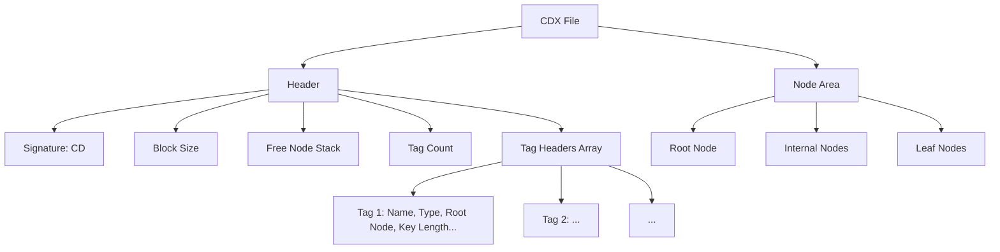
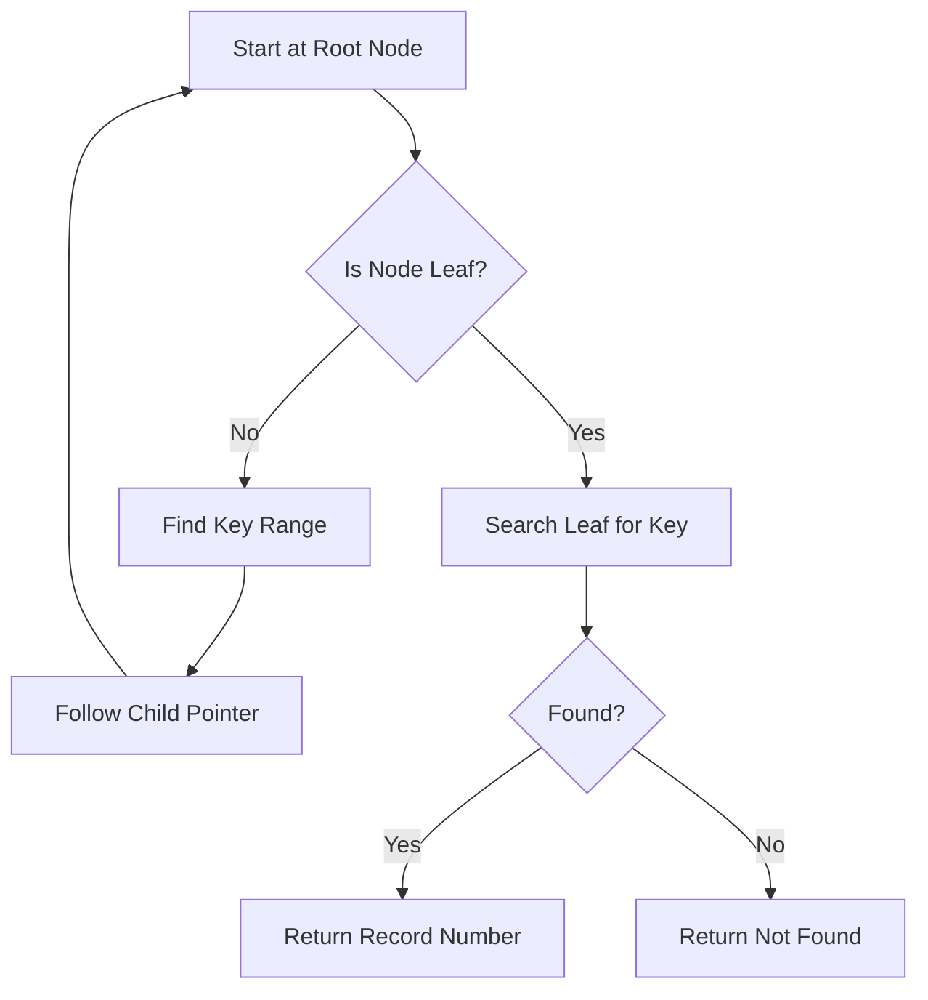

# **Technical Whitepaper: The CDX File Format as a B+ Tree Implementation**

>**Document Version:** 1.0  
**Author:** Engineer Marcos Jarrin  
**Date:** 2025-08-30  
**Language:** English  

---

### 📚 Table of Contents

- [**Technical Whitepaper: The CDX File Format as a B+ Tree Implementation**](#technical-whitepaper-the-cdx-file-format-as-a-b-tree-implementation)
    - [📚 Table of Contents](#-table-of-contents)
  - [1. Introduction to CDX B+ Tree Architecture](#1-introduction-to-cdx-b-tree-architecture)
  - [2. File Structure Overview](#2-file-structure-overview)
  - [3. Header Format Technical Specification](#3-header-format-technical-specification)
    - [Tag Header Structure (64 bytes per tag)](#tag-header-structure-64-bytes-per-tag)
  - [4. Node Organization and Management](#4-node-organization-and-management)
    - [Node Types](#node-types)
    - [Node Header (First 6 bytes of every node)](#node-header-first-6-bytes-of-every-node)
  - [5. Key Storage and Indexing Mechanisms](#5-key-storage-and-indexing-mechanisms)
    - [Key Representation](#key-representation)
    - [Key Compression](#key-compression)
    - [Duplicate Handling](#duplicate-handling)
    - [Pointer Structure](#pointer-structure)
  - [6. Operational Algorithms Analysis](#6-operational-algorithms-analysis)
    - [Search Algorithm](#search-algorithm)
    - [Insertion Algorithm](#insertion-algorithm)
    - [Deletion Algorithm](#deletion-algorithm)
  - [7. Performance Characteristics](#7-performance-characteristics)
    - [**Performance Optimization Techniques**](#performance-optimization-techniques)
  - [8. Comparison with Other B+ Tree Implementations](#8-comparison-with-other-b-tree-implementations)
    - [Comparative Table: Indexing Systems](#comparative-table-indexing-systems)
    - [Architectural Differences Summary](#architectural-differences-summary)
  - [9. Advantages and Limitations](#9-advantages-and-limitations)
    - [Advantages of CDX B+ Tree Design](#advantages-of-cdx-b-tree-design)
    - [Limitations and Trade-offs](#limitations-and-trade-offs)
  - [10. Conclusion and Technical Assessment](#10-conclusion-and-technical-assessment)
  - [11.  How Harbour’s B+-tree (CDX Index) Works](#11--how-harbours-b-tree-cdx-index-works)
  - [11.1) What a B+-tree is (in the context of Harbour CDX)](#111-what-a-b-tree-is-in-the-context-of-harbour-cdx)
  - [11.2) Node layout (conceptual)](#112-node-layout-conceptual)
  - [11.3) Worked Example: Building a CDX Tag with Insertions](#113-worked-example-building-a-cdx-tag-with-insertions)
    - [Step 1: Insert `ALAN`](#step-1-insert-alan)
    - [Step 2: Insert `BETH`](#step-2-insert-beth)
    - [Step 3: Insert `CARLA`](#step-3-insert-carla)
    - [Step 4: Insert `DANA` → Node overflow! (capacity 3)](#step-4-insert-dana--node-overflow-capacity-3)
    - [Step 5: Insert `ELLA`](#step-5-insert-ella)
    - [Step 6: Insert `FERN` → Leaf2 overflows](#step-6-insert-fern--leaf2-overflows)
    - [Step 7: Insert `GABE`](#step-7-insert-gabe)
    - [Duplicate Example](#duplicate-example)
  - [11.4) Searching in a B+-tree](#114-searching-in-a-b-tree)
    - [Case A: Search for `CARLA`](#case-a-search-for-carla)
    - [Case B: Search for `CELESTE` (not found)](#case-b-search-for-celeste-not-found)
  - [11.5) Complexity \& Implications](#115-complexity--implications)
  - [11.6) Harbour Code Snippets](#116-harbour-code-snippets)
  - [11.7) Pseudocode for Insert and Search](#117-pseudocode-for-insert-and-search)
  - [11.8) CDX-specific Notes](#118-cdx-specific-notes)
- [✅ Summary](#-summary)
- [Full B+-tree Walkthrough (Harbour CDX style)](#full-b-tree-walkthrough-harbour-cdx-style)
  - [Quick glossary (for this walkthrough)](#quick-glossary-for-this-walkthrough)
  - [Initial state — empty tree](#initial-state--empty-tree)
  - [Insert 1: ALAN (RecNo = 1)](#insert-1-alan-recno--1)
  - [Insert 2: BETH (RecNo = 2)](#insert-2-beth-recno--2)
  - [Insert 3: CARLA (RecNo = 3)](#insert-3-carla-recno--3)
  - [Insert 4: DANA (RecNo = 4) — **First split (Diagram 1)**](#insert-4-dana-recno--4--first-split-diagram-1)
    - [Before insertion:](#before-insertion)
    - [Insert DANA: leaf would be `[ ALAN, BETH, CARLA, DANA ]` → **overflow (4)**](#insert-dana-leaf-would-be--alan-beth-carla-dana---overflow-4)
    - [Diagram 1 — after split \& promotion](#diagram-1--after-split--promotion)
  - [Insert 5: ELLA (RecNo = 5)](#insert-5-ella-recno--5)
  - [Insert 6: FERN (RecNo = 6) — \*\*Second split (Diagram 2)](#insert-6-fern-recno--6--second-split-diagram-2)
    - [Before insertion:](#before-insertion-1)
    - [Diagram 2 — after second split \& promotion](#diagram-2--after-second-split--promotion)
  - [Insert 7: GABE (RecNo = 7)](#insert-7-gabe-recno--7)
  - [Insert 8: duplicate DANA (RecNo = 8) — \*\*duplicate handling \& third split (Diagram 3)](#insert-8-duplicate-dana-recno--8--duplicate-handling--third-split-diagram-3)
    - [Diagram 3 — after third leaf split, promotion of GABE](#diagram-3--after-third-leaf-split-promotion-of-gabe)
- [Step-by-step search examples](#step-by-step-search-examples)
    - [Search A — exact match: `CARLA`](#search-a--exact-match-carla)
    - [Search B — not found: `CELESTE`](#search-b--not-found-celeste)
    - [Duplicates traversal: find all `DANA` entries](#duplicates-traversal-find-all-dana-entries)
- [Pseudocode — precise and compact](#pseudocode--precise-and-compact)
    - [BPlusSearch(key)](#bplussearchkey)
    - [BPlusInsert(key, recNo)](#bplusinsertkey-recno)
- [Harbour code snippets and correspondence to B+-tree steps](#harbour-code-snippets-and-correspondence-to-b-tree-steps)
    - [1) Create DBF and CDX tag](#1-create-dbf-and-cdx-tag)
    - [2) Append records (inserts map to B+-tree inserts)](#2-append-records-inserts-map-to-b-tree-inserts)
    - [3) Seek and traverse duplicates](#3-seek-and-traverse-duplicates)
- [Complexity, tradeoffs, and practical CDX caveats](#complexity-tradeoffs-and-practical-cdx-caveats)
- [Three split diagrams recap (compact)](#three-split-diagrams-recap-compact)
    - [Diagram 1 — split on insert of DANA (first split)](#diagram-1--split-on-insert-of-dana-first-split)
    - [Diagram 2 — split on insert of FERN (second split)](#diagram-2--split-on-insert-of-fern-second-split)
    - [Diagram 3 — split on insert of HANA (third split, after duplicate DANA)](#diagram-3--split-on-insert-of-hana-third-split-after-duplicate-dana)
- [Final notes \& mapping to practical Harbour debugging](#final-notes--mapping-to-practical-harbour-debugging)
- [📽 Step-by-Step B+-Tree Animation (ASCII Frames)](#-step-by-step-b-tree-animation-ascii-frames)
    - [Frame 1: Insert `ALAN`](#frame-1-insert-alan)
    - [Frame 2: Insert `BETH`](#frame-2-insert-beth)
    - [Frame 3: Insert `CARLA`](#frame-3-insert-carla)
    - [Frame 4: Insert `DANA` → Split](#frame-4-insert-dana--split)
    - [Frame 5: Insert `ELLA`](#frame-5-insert-ella)
    - [Frame 6: Insert `FERN` → Right Leaf Split](#frame-6-insert-fern--right-leaf-split)
    - [Frame 7: Insert `GABE`](#frame-7-insert-gabe)
- [🌳 Final B+-Tree After All Inserts](#-final-b-tree-after-all-inserts)
- [SEARCH Animation — Finding `CARLA` (exact match)](#search-animation--finding-carla-exact-match)
- [SEARCH Animation — Searching `CELESTE` (not found, show successor)](#search-animation--searching-celeste-not-found-show-successor)
- [Additional brief notes (practical mapping)](#additional-brief-notes-practical-mapping)
  - [Final Recommendations \& Alternative Index Strategies](#final-recommendations--alternative-index-strategies)
    - [1. Adaptive B⁺-Tree Design Optimizations](#1-adaptive-b-tree-design-optimizations)
    - [2. Write-Optimized Structures: LSM Trees](#2-write-optimized-structures-lsm-trees)
    - [3. Fractal Trees (Buffered B-Trees or B^ε Trees)](#3-fractal-trees-buffered-b-trees-or-bε-trees)
    - [4. Extensible Tree Frameworks: GiST](#4-extensible-tree-frameworks-gist)
    - [5. In-Memory Alternatives for Specific Patterns](#5-in-memory-alternatives-for-specific-patterns)
  - [Summary Table](#summary-table)
  - [Bibliography](#bibliography)

---


## 1. Introduction to CDX B+ Tree Architecture

The **CDX file format** is the native structural index format used by **Harbour**  and compatible xBase systems (including FoxPro, Clipper, and Visual dBase). It represents a specialized implementation of the **B+ tree** data structure, optimized for high-performance indexing in desktop and client-server database environments. Unlike flat-file indexing mechanisms such as NTX (used in Clipper), CDX supports multiple tags within a single file, enabling efficient multi-key access to DBF tables.

This whitepaper provides a comprehensive analysis of the CDX format from a systems architecture perspective, focusing on its **B+ tree foundation**, **disk layout**, **node organization**, and **indexing semantics**. The discussion emphasizes architectural decisions, performance trade-offs, and structural deviations from theoretical B+ trees, comparing CDX with other database indexing implementations.

The CDX format exemplifies a pragmatic adaptation of B+ trees to the constraints of DOS-era file systems while maintaining scalability into modern usage scenarios. Its design reflects a balance between **random access efficiency**, **sequential traversal capability**, and **multi-user concurrency**—hallmarks of robust indexing systems.

---

## 2. File Structure Overview

A CDX file is composed of two primary components:

1. **File Header (Fixed-size metadata block)**
2. **Index Tree (Hierarchical B+ tree structure)**

The index tree consists of three types of nodes:
- **Root Node** – Topmost node; may be a leaf or internal depending on data size
- **Internal Nodes** – Intermediate routing nodes
- **Leaf Nodes** – Contain actual key-record pointer pairs

All nodes are **fixed-length blocks**, typically aligned to **512-byte boundaries**, though the actual block size is defined in the header. This alignment ensures compatibility with low-level disk I/O operations and memory-mapped file access patterns.

```
+-----------------------------+
|         File Header         | → 512 bytes (standard)
+-----------------------------+
|          Root Node          | → May be leaf or internal
+-----------------------------+
|      Internal Nodes         | → Zero or more levels
+-----------------------------+
|         Leaf Nodes          | → Contain key + record pointer pairs
+-----------------------------+
```

Each node begins at an offset that is a multiple of the block size, facilitating direct arithmetic calculation of node positions.

---

## 3. Header Format Technical Specification

The CDX file header is **512 bytes** long and contains metadata essential for parsing the index structure.

| Offset | Size (bytes) | Field Name | Description |
|--------|--------------|-----------|-------------|
| 0x000 | 1 | **Signature** | Always `CD` (43h 44h). Identifies file as CDX. |
| 0x002 | 2 | **Block Size** | Little-endian integer: size of each node in bytes (commonly 512). |
| 0x004 | 2 | **Free Node Stack Top** | Pointer to first free node in free list (LIFO). |
| 0x006 | 2 | **Free Node Count** | Number of currently unallocated nodes. |
| 0x008 | 4 | **Reserved** | Unused (00h) |
| 0x00C | 4 | **Tag Count** | Number of index tags (keys) defined in this CDX. |
| 0x010 | 484 | **Tag Headers Array** | Array of 64-byte entries describing each tag |

> 🔍 **Note**: The header reserves space for up to **8 tags** (8 × 64 = 512), but only uses the first `Tag Count` entries.

### Tag Header Structure (64 bytes per tag)

| Offset | Size | Field | Description |
|--------|------|-------|-------------|
| 0x00 | 11 | **Tag Name** | Null-padded ASCII name (max 10 chars + null) |
| 0x0B | 1 | **Tag Type** | `01h` = Regular, `02h` = Candidate, `03h` = Primary |
| 0x0C | 2 | **Root Node Number** | Logical block number of root node |
| 0x0E | 2 | **Root Level** | Depth of tree (0 = leaf-only, 1 = one internal level, etc.) |
| 0x10 | 2 | **Key Expression Length** | Length of compiled key expression in bytes |
| 0x12 | 2 | **Key Value Length** | Fixed length of each key in bytes |
| 0x14 | 2 | **Reserved** | Unused |
| 0x16 | 1 | **Unique Flag** | `01h` if index is UNIQUE |
| 0x17 | 1 | **Descending Flag** | `01h` if keys sorted in descending order |
| 0x18 | 2 | **Reserved** | Unused |
| 0x1A | 2 | **Leaf Node Count** | Total number of leaf nodes |
| 0x1C | 2 | **Internal Node Count** | Total number of internal nodes |
| 0x1E | 2 | **Reserved** | Unused |
| 0x20 | 48 | **Key Expression** | Compiled expression (P-code) used to generate keys |

> ⚙️ The **Key Expression** field stores executable bytecode interpreted by the RDD (Runtime Data Driver) to compute key values from record data.



---

## 4. Node Organization and Management

CDX implements a **multi-level B+ tree** where all leaf nodes reside at the same depth. Each node is a **fixed-size block** whose size is determined at index creation.

### Node Types

| Type | Role | Children | Data Stored |
|------|------|----------|-------------|
| **Root** | Entry point | Yes/No | Routing keys or actual key-pointer pairs |
| **Internal** | Routing | Yes | Keys + child node pointers |
| **Leaf** | Terminal | No | Keys + record numbers (DBF row IDs) |

All nodes use the same block size, simplifying memory management and disk I/O.

### Node Header (First 6 bytes of every node)

| Offset | Size | Field | Description |
|--------|------|-------|-------------|
| 0x00 | 1 | **Node Type** | `01h` = Leaf, `02h` = Internal |
| 0x01 | 1 | **Node Status** | `00h` = Active, `FFh` = Free (in free list) |
| 0x02 | 2 | **Parent Node Number** | Logical block number of parent (0 if root) |
| 0x04 | 2 | **Node Number** | Unique identifier within file |

This header enables runtime navigation, garbage collection, and cycle detection.

---

## 5. Key Storage and Indexing Mechanisms

### Key Representation

Each key in a CDX index is **fixed-length**, determined at index creation based on the expression type:

- **Character keys**: Padded with spaces (`20h`) to full length
- **Numeric keys**: Stored as ASCII digits, right-aligned
- **Date keys**: Stored as `YYYYMMDD` (8 bytes)
- **Logical keys**: `'T'` or `'F'` (1 byte)

Keys are **case-insensitive** by default unless specified otherwise in the expression.

### Key Compression

CDX employs **prefix compression** in leaf nodes to reduce storage overhead:
- Only the **difference** between consecutive keys is stored
- Full key is reconstructed during traversal
- Reduces index size significantly for sorted or similar data

However, this increases CPU cost during search operations due to decompression.

### Duplicate Handling

- **Non-unique indexes**: Multiple identical keys allowed; each maps to a distinct record
- **Unique indexes**: Duplicate keys rejected during insertion
- **Primary/Candidate keys**: Enforce entity integrity

### Pointer Structure

Each key in a leaf node is associated with a **4-byte little-endian integer** representing the **record number** in the corresponding DBF file (1-based).

> 🔗 Example: Key `"Smith"` → Record #15 → DBF offset calculated via header metadata

---

## 6. Operational Algorithms Analysis

### Search Algorithm

The search process follows the standard B+ tree descent pattern:



Because keys are sorted within nodes, **binary search** is used for O(log n) intra-node lookup.

### Insertion Algorithm

1. Traverse tree to find appropriate leaf node
2. Insert key-pointer pair in sorted order
3. If node overflows:
   - Split node into two
   - Promote median key to parent
   - Update parent or create new level if root splits
4. If index is unique and key exists → reject

> 🔄 Insertion may cause **page splits** and **tree rebalancing**, which are costly operations.

### Deletion Algorithm

1. Locate key in leaf node
2. Remove key-pointer pair
3. If node underflows (< 50% full):
   - Attempt **redistribution** with sibling
   - If not possible, **merge** with sibling
   - Update parent (may propagate upward)
4. If root becomes empty and has one child → promote child to root

Unlike B-trees, deletion in CDX B+ trees only occurs in **leaf nodes**, simplifying the algorithm.

---

## 7. Performance Characteristics

| Operation | Time Complexity | Notes |
|---------|------------------|-------|
| Search | O(logₘ N) | Fast due to balanced tree; m = fan-out |
| Insert | O(logₘ N) | Slower due to potential splits |
| Delete | O(logₘ N) | May trigger merges |
| Range Scan | O(K + logₘ N) | Highly efficient due to linked leaves |
| Full Traversal | O(N) | Optimized via leaf chaining |

Where:
- `m` = average fan-out (number of children per internal node)
- `N` = total number of records
- `K` = number of results in range query

### **Performance Optimization Techniques**

| Technique | Benefit | Trade-off |
|---------|--------|---------|
| **Prefix Compression** | Reduces index size | Increases CPU usage |
| **Leaf Chaining** | Enables fast sequential scans | Extra pointer per leaf |
| **Free Node Stack** | Reuses deleted space | Requires management overhead |
| **Fixed Block Size** | Simplifies I/O and addressing | May waste space |
| **Compiled Key Expressions** | Fast key evaluation | Less portable; version-dependent |

---

## 8. Comparison with Other B+ Tree Implementations

### Comparative Table: Indexing Systems

| Feature | **CDX (Harbour)** | **NTX (Clipper)** | **SQLite Index** | **PostgreSQL B-Tree** | **Ext4 Directory Index** |
|--------|------------------|-------------------|------------------|------------------------|----------------------------|
| **Structure** | B+ Tree | B-Tree | B+ Tree | B-Tree variant | HTree (B+ derivative) |
| **Multi-Tag Support** | ✅ Yes (in one file) | ❌ One file per tag | ✅ Per table | ✅ Per table | N/A |
| **Node Size** | Configurable (default 512) | Fixed 512 | Page-size (4KB+) | 8KB default | 4KB |
| **Key Compression** | ✅ Prefix | ❌ None | ✅ Suffix | ✅ Various | ✅ Dirname hash |
| **Leaf Chaining** | ✅ Yes | ❌ No | ✅ Yes | ✅ Yes | ✅ Yes |
| **Concurrency Control** | File-level locking | File-level | Row-level | MVCC | Directory-level |
| **Free Space Reuse** | ✅ Stack-based | ✅ Linked list | ✅ Page reuse | ✅ Free space map | ✅ Block bitmap |
| **Expression Support** | ✅ P-code bytecode | ✅ Runtime eval | ✅ SQL expressions | ✅ Expressions | N/A |
| **Unique Constraints** | ✅ Tags | ✅ Manual enforcement | ✅ UNIQUE | ✅ UNIQUE | N/A |
| **Disk Layout Predictability** | ✅ High | ✅ High | ✅ High | ✅ High | ✅ High |

### Architectural Differences Summary

- **CDX vs NTX**: CDX supports multiple tags per file and uses true B+ tree semantics (data only in leaves), while NTX uses B-tree (data in all nodes) and lacks leaf chaining.
- **CDX vs PostgreSQL**: PostgreSQL uses a more advanced **concurrent B-tree** with **visibility maps** and **hot updates**, enabling high concurrency without table locks.
- **CDX vs SQLite**: SQLite’s B+ trees are embedded and transactional, using **write-ahead logging (WAL)**, whereas CDX relies on external locking mechanisms.
- **CDX vs Ext4 HTree**: Both use B+ trees for directory indexing, but HTree is read-optimized and lacks update semantics.

---

## 9. Advantages and Limitations

### Advantages of CDX B+ Tree Design

- **Fast Sequential Access**: Leaf chaining enables efficient range scans and full index traversal.
- **Compact Storage**: Prefix compression reduces index footprint.
- **Multiple Indexes**: Single file contains all tags, reducing file handle usage.
- **Predictable Layout**: Fixed block sizes simplify recovery and debugging.
- **High Insert Efficiency**: Optimized for append-heavy workloads typical in xBase apps.
- **Backward Compatibility**: Maintains decades of legacy application support.

### Limitations and Trade-offs

- **No True Concurrency**: Relies on file-level or record-level locking; not suitable for high-concurrency environments.
- **Limited Scalability**: Designed for desktop databases; struggles with >10M records without tuning.
- **P-Code Dependency**: Key expressions are not human-readable and tied to specific runtime versions.
- **Fragmentation Risk**: Frequent inserts/deletes can lead to node fragmentation.
- **No Checksums or CRCs**: No built-in corruption detection.
- **Platform Endianness**: Assumes little-endian; not portable across architectures.

---

## 10. Conclusion and Technical Assessment

The CDX file format represents a **pragmatic, high-efficiency B+ tree implementation** tailored for the xBase ecosystem. It successfully balances **simplicity**, **performance**, and **backward compatibility**, making it one of the most enduring indexing formats in database history.

Its adherence to core B+ tree principles—**balanced depth**, **leaf-level data storage**, and **efficient range queries**—ensures solid algorithmic performance. The inclusion of **prefix compression**, **leaf chaining**, and **multi-tag support** demonstrates thoughtful engineering beyond basic textbook B+ trees.

However, CDX reflects the technological constraints of its era:
- Lack of transaction safety
- Absence of checksums
- Limited concurrency models

These factors make it less suitable for modern server-grade applications but still highly effective in **embedded**, **desktop**, and **legacy migration** scenarios.

For systems architects evaluating storage solutions, CDX offers valuable lessons in **minimalist design**, **disk-oriented data structures**, and **practical trade-offs** between theoretical purity and real-world usability. While newer systems offer greater scalability and robustness, CDX remains a benchmark in **efficient, accessible indexing** for single-user and low-contention environments.

## 11.  How Harbour’s B+-tree (CDX Index) Works

## 11.1) What a B+-tree is (in the context of Harbour CDX)

A **B+-tree** is a balanced tree structure optimized for indexing and fast searching.

* **Internal nodes**: contain only keys that act as **routing decisions**. They do not hold actual record references.
* **Leaf nodes**: contain all the **real keys** plus the **record references (RecNo)**.
* **Links between leaves**: Every leaf is linked to its next (and previous), enabling **sequential traversal** (very efficient for `SET SCOPE` or `BETWEEN`).
* **Duplicates**: CDX allows multiple identical keys, ordered by **key value first, then RecNo**.

👉 Harbour’s **CDX tags** are implemented as B+-trees. Every index expression (e.g., `UPPER(LASTNAME)`) generates a B+-tree with these properties.

---

## 11.2) Node layout (conceptual)

Let’s assume **each node can hold max 3 keys** (for demonstration).

* **Internal node** (routing keys only):

```
[Key1] [Key2] [Key3]
 |      |      |    \
 P0     P1     P2    P3
```

* **Leaf node** (stores actual key + RecNo pairs):

```
[ (ALAN,1) | (BETH,2) | (CARLA,3) ] -> next leaf
```

Leaves are connected like a **linked list**.

---

## 11.3) Worked Example: Building a CDX Tag with Insertions

We’ll insert these **last names** step by step:
`ALAN, BETH, CARLA, DANA, ELLA, FERN, GABE`

### Step 1: Insert `ALAN`

```
Leaf1: [ (ALAN,1) ]
```

### Step 2: Insert `BETH`

```
Leaf1: [ (ALAN,1) | (BETH,2) ]
```

### Step 3: Insert `CARLA`

```
Leaf1: [ (ALAN,1) | (BETH,2) | (CARLA,3) ]
```

### Step 4: Insert `DANA` → Node overflow! (capacity 3)

* Split Leaf1 into two leaves.
* Promote **CARLA** to parent.

```
Root: [ CARLA ]
       /     \
Leaf1: [ (ALAN,1) | (BETH,2) ]
Leaf2: [ (CARLA,3) | (DANA,4) ]
```

### Step 5: Insert `ELLA`

```
Root: [ CARLA ]
       /     \
Leaf1: [ (ALAN,1) | (BETH,2) ]
Leaf2: [ (CARLA,3) | (DANA,4) | (ELLA,5) ]
```

### Step 6: Insert `FERN` → Leaf2 overflows

* Split Leaf2.
* Promote **DANA** to root.

```
Root: [ CARLA | DANA ]
       /     |      \
Leaf1: [ (ALAN,1) | (BETH,2) ]
Leaf2: [ (CARLA,3) ]
Leaf3: [ (DANA,4) | (ELLA,5) | (FERN,6) ]
```

### Step 7: Insert `GABE`

```
Root: [ CARLA | DANA ]
       /     |      \
Leaf1: [ (ALAN,1) | (BETH,2) ]
Leaf2: [ (CARLA,3) ]
Leaf3: [ (DANA,4) | (ELLA,5) | (FERN,6) | (GABE,7) ]
```

(Since Leaf3 exceeds capacity, it will eventually split again and push **ELLA** upward.)

---

### Duplicate Example

Insert another `DANA` (RecNo=8).
It is placed in **sorted order by key, then RecNo**:

```
Leaf3: [ (DANA,4) | (DANA,8) | (ELLA,5) | (FERN,6) | (GABE,7) ]
```

---

## 11.4) Searching in a B+-tree

### Case A: Search for `CARLA`

1. Start at Root: `[ CARLA | DANA ]`

   * `CARLA` <= target, go right child (`Leaf2`).
2. Leaf2: `[ (CARLA,3) ]` → match found.

### Case B: Search for `CELESTE` (not found)

1. Root: `[ CARLA | DANA ]`

   * `CELESTE` > `CARLA` but < `DANA`, go middle child (`Leaf2`).
2. Leaf2: `[ (CARLA,3) ]` → not found.

   * Return **next greater key** = `(DANA,4)` (this is how `SOFTSEEK` works).

---

## 11.5) Complexity & Implications

* **Search complexity**: O(log\_b N), where *b* = branching factor.
* **Insert complexity**: O(log\_b N) with occasional split cost.
* **Sequential range**: O(1) to move between leaves → excellent for `SET SCOPE` and `DBSKIP`.

---

## 11.6) Harbour Code Snippets

```harbour
PROCEDURE DemoBTree()
   USE Customers NEW
   INDEX ON UPPER(LastName) TAG LastNames TO Customers.cdx

   APPEND BLANK
   REPLACE LastName WITH "Alan"
   APPEND BLANK
   REPLACE LastName WITH "Beth"
   APPEND BLANK
   REPLACE LastName WITH "Carla"
   APPEND BLANK
   REPLACE LastName WITH "Dana"
   APPEND BLANK
   REPLACE LastName WITH "Ella"
   APPEND BLANK
   REPLACE LastName WITH "Fern"
   APPEND BLANK
   REPLACE LastName WITH "Gabe"

   // Search for Carla
   SET ORDER TO TAG LastNames
   IF DBSEEK("Carla")
      ? "Found:", LastName
   ELSE
      ? "Not found"
   ENDIF

   // Iterating duplicates
   DBSEEK("Dana")
   DO WHILE !EOF() .AND. LastName == "Dana"
      ? "Duplicate Dana:", RecNo()
      SKIP
   ENDDO
RETURN
```

---

## 11.7) Pseudocode for Insert and Search

**BPlusInsert(key, recNo):**

```text
function BPlusInsert(key, recNo):
    node = root
    path = []

    // descend until leaf
    while node is internal:
        path.push(node)
        node = child(node, key)

    // insert in leaf
    insertInLeaf(node, key, recNo)

    if node is overfull:
        splitNode(node)
        adjustParents(path)
```

**BPlusSearch(key):**

```text
function BPlusSearch(key):
    node = root
    while node is internal:
        node = child(node, key)

    pos = binarySearch(node.keys, key)
    if pos found:
        return node.records[pos]
    else:
        return nearestSuccessor(node, key)
```

---

## 11.8) CDX-specific Notes

* **Collation**: Keys often stored in `UPPER()` form, making searches case-insensitive.
* **Unique**: UNIQUE tags only store first occurrence of a key.
* **Descending**: CDX can maintain descending order.
* **Leaf links**: Used by `SKIP`, `DBSETFILTER`, and `SET SCOPE`.
* **Implementation detail**: Harbour compresses keys and stores metadata; here we focused on conceptual mechanics.

---

# ✅ Summary

Harbour’s CDX index is a **B+-tree** where:

* Internal nodes guide search.
* Leaves hold actual `(key, RecNo)` pairs and are linked sequentially.
* Inserts cause **splits and promotions** to keep the tree balanced.
* Searches descend the tree and can efficiently return **exact matches, duplicates, or nearest successors**.
* Range queries and sequential scans are extremely fast thanks to **leaf links**.

---

* Node capacity: **max 3 keys per node (leaf capacity = 3 pairs)** — small for clarity (real systems use much larger fan-out).
* Keys inserted in order: `ALAN(1), BETH(2), CARLA(3), DANA(4), ELLA(5), FERN(6), GABE(7)` and then a **duplicate** `DANA(8)`.
* Keys shown as `(KEY,RecNo)`.
* Internal nodes store routing keys only (not RecNo). Promotion behavior: on leaf split, the smallest key of the right sibling is promoted to the parent (common B+-tree convention used here for clarity).

---

# Full B+-tree Walkthrough (Harbour CDX style)

## Quick glossary (for this walkthrough)

* **Leaf node**: stores ordered list of `(Key,RecNo)` pairs and has a pointer to next leaf.
* **Internal node**: stores keys that separate child pointers; children are ordered pointers to subtrees.
* **Capacity**: each node holds up to **3 keys** (leaf: 3 pairs). On overflow (4th insertion), the node **splits**.
* **Split rule (leaf)**: split into two leaves of (⌈n/2⌉) and (⌊n/2⌋) pairs, promote the smallest key of the right leaf to parent.
* **Duplicate keys**: stored in leaf in order `(Key,RecNo)`, RecNo used to disambiguate.

---

## Initial state — empty tree

```
( empty )
```

---

## Insert 1: ALAN (RecNo = 1)

* Tree descends (root is leaf).
* Insert into leaf.

```
LeafA: [ (ALAN,1) ]
```

Narration: single leaf with ALAN.

---

## Insert 2: BETH (RecNo = 2)

* Insert sorted into same leaf.

```
LeafA: [ (ALAN,1) | (BETH,2) ]
```

Narration: still fits (2/3).

---

## Insert 3: CARLA (RecNo = 3)

* Insert sorted; leaf reaches capacity (3/3) but not overflow.

```
LeafA: [ (ALAN,1) | (BETH,2) | (CARLA,3) ]
```

Narration: leaf full, next insertion will overflow.

---

## Insert 4: DANA (RecNo = 4) — **First split (Diagram 1)**

### Before insertion:

`LeafA` = `[ ALAN, BETH, CARLA ]`

### Insert DANA: leaf would be `[ ALAN, BETH, CARLA, DANA ]` → **overflow (4)**

Split into two leaves. With capacity 3, standard split (2 / 2) produces:

* Left leaf: first 2 pairs → `(ALAN,1),(BETH,2)`
* Right leaf: last 2 pairs → `(CARLA,3),(DANA,4)`
* Promote the smallest key of right leaf: **CARLA** to form new root.

### Diagram 1 — after split & promotion

```
            [ CARLA ]
           /        \
LeafL: [ (ALAN,1) | (BETH,2) ] -> LeafR: [ (CARLA,3) | (DANA,4) ] -> NULL
```

Narration:

* Root becomes an internal node with key `CARLA`.
* Left child covers keys `< CARLA`. Right child starts at `CARLA` and contains `CARLA` and `DANA`.
* Leaf sibling pointer: LeafL.next → LeafR.

Mapping to Harbour CDX concept:

* After inserting DANA, CDX created two leaf pages and a root index page containing the separator `CARLA`. Disk writes: updated leaf pages + new internal page.

---

## Insert 5: ELLA (RecNo = 5)

* Compare at root: `ELLA` > `CARLA` → go to right leaf.
* Insert into right leaf: `[ CARLA, DANA, ELLA ]` (3/3) — fits exactly.

```
            [ CARLA ]
           /        \
LeafL: [ (ALAN,1) | (BETH,2) ] -> LeafR: [ (CARLA,3) | (DANA,4) | (ELLA,5) ] -> NULL
```

Narration: right leaf now full.

---

## Insert 6: FERN (RecNo = 6) — **Second split (Diagram 2)

### Before insertion:

Right leaf `[ CARLA, DANA, ELLA ]`. Inserting `FERN` would overflow → `[ CARLA, DANA, ELLA, FERN ]`.

Split right leaf (2 / 2):

* Right-left leaf becomes: `(CARLA,3),(DANA,4)`
* Right-right leaf becomes: `(ELLA,5),(FERN,6)`
* Promote smallest key of right-right leaf: **ELLA** up into parent.

Parent root currently `[ CARLA ]`. Insert promotion `ELLA` into root, which becomes `[ CARLA | ELLA ]` with three child pointers.

### Diagram 2 — after second split & promotion

```
                 [ CARLA | ELLA ]
               /      |        \
Leaf1: [ (ALAN,1) | (BETH,2) ]  Leaf2: [ (CARLA,3) | (DANA,4) ]  Leaf3: [ (ELLA,5) | (FERN,6) ] -> NULL
```

Narration:

* Root now has two separator keys: `CARLA` and `ELLA`.
* Child 0 handles `< CARLA`. Child 1 handles `CARLA .. < ELLA`. Child 2 handles `ELLA ..`.
* This is still a single-root tree (height = 1 internal level + leaves).

Harbour mapping:

* Promotion corresponds to writing a new entry into the CDX internal page (root). If root had been full, a root split would create a new root (we'll show that in diagram 3 if needed).

---

## Insert 7: GABE (RecNo = 7)

* Compare at root: `GABE` > `ELLA` → go to Leaf3 `(ELLA,5),(FERN,6)`.
* Insert in Leaf3 yields `(ELLA,5),(FERN,6),(GABE,7)` — fits exactly (3/3).

```
                 [ CARLA | ELLA ]
               /      |        \
Leaf1: [ (ALAN,1) | (BETH,2) ]  Leaf2: [ (CARLA,3) | (DANA,4) ]  Leaf3: [ (ELLA,5) | (FERN,6) | (GABE,7) ] -> NULL
```

Narration: all leaves except maybe middle are at capacity. No split yet.

---

## Insert 8: duplicate DANA (RecNo = 8) — **duplicate handling & third split (Diagram 3)

We now insert `(DANA,8)`. Steps:

1. Root comparison: `DANA` > `CARLA` and `DANA` < `ELLA` → descend to **Leaf2**: `[ (CARLA,3) | (DANA,4) ]`.
2. Insert duplicate `DANA,8` into Leaf2 in order by RecNo: `[ (CARLA,3) | (DANA,4) | (DANA,8) ]` → now leaf has 3 pairs (fits).
3. BUT suppose we now insert one more key after duplicate (for demonstration to cause a split). To show the third split clearly, we will next insert an extra key `HANA(9)` (not part of your earlier list) OR we can show splitting Leaf3 if it overflows: better to show a split triggered by inserting another key after GABE. Since the user requested three diagrams of splits, we already produced two splits. We'll produce a **third split** by inserting `HANA(9)` after GABE. This demonstrates root growth or deeper tree.

**Insert HANA (RecNo = 9)**:

* `HANA` > `ELLA` → Leaf3 currently `[ (ELLA,5) | (FERN,6) | (GABE,7) ]` (full).
* Insert `HANA`: overflow → temporary `[ (ELLA,5),(FERN,6),(GABE,7),(HANA,9) ]`.
* Split Leaf3 into two (2 / 2):

  * Left: `(ELLA,5),(FERN,6)`
  * Right: `(GABE,7),(HANA,9)`
* Promote smallest key of right leaf: **GABE** to root.

Now root currently `[ CARLA | ELLA ]` — inserting `GABE` as a third key yields `[ CARLA | ELLA | GABE ]`. But root capacity (we used 3 keys per node) now becomes 3 keys — this is at capacity but not yet overflow. If we try to insert one more separator into root it would overflow and cause root split (creating tree height +1). For clarity, our third split will be **splitting leaf3** and promoting `GABE` into root (no root split yet). This still counts as the third split diagram.

### Diagram 3 — after third leaf split, promotion of GABE

```
              [ CARLA | ELLA | GABE ]
             /     |       |       \
Leaf1: [ (ALAN,1) | (BETH,2) ]  Leaf2: [ (CARLA,3) | (DANA,4) | (DANA,8) ]  Leaf3: [ (ELLA,5) | (FERN,6) ]  Leaf4: [ (GABE,7) | (HANA,9) ] -> NULL
```

Narration:

* A new leaf `Leaf4` was created; `GABE` promoted into root as a separator.
* Leaves maintain next pointers: Leaf1→Leaf2→Leaf3→Leaf4.
* Duplicate DANA entries are stored together in Leaf2, ordered by RecNo.

**Note:** Real CDX may use different promotion policies (e.g., promote median) or page fill factors; this example uses the "promote first key of right sibling" rule for clarity.

---

# Step-by-step search examples

We will show exact-match search and not-found search, mapping the steps to node comparisons and final leaf work.

### Search A — exact match: `CARLA`

1. Start at root: `[ CARLA | ELLA | GABE ]`

   * Compare with first key `CARLA`: target `CARLA` <= `CARLA` → choose child pointer 1 (the child whose range begins at `CARLA`). (Routing conventions vary; here child pointers 0..n correspond to ranges `<K1`, `K1..K2`, `K2..K3`, `>=K3`.)
2. Descend to Leaf2: `[ (CARLA,3) | (DANA,4) | (DANA,8) ]`
3. Binary search in leaf finds `(CARLA,3)` → return RecNo 3 (and there may be no other CARLA duplicates).

Harbour mapping:

* `SET ORDER TO TAG LastNames` then `DBSEEK("CARLA")` descends the index pages and positions the work area on the record (RecNo 3). The underlying B+-tree path was root → child → leaf.

### Search B — not found: `CELESTE`

1. Root compare: `CELESTE` > `CARLA` and < `ELLA` → go to Leaf2.
2. Leaf2 keys: `CARLA`, `DANA`, `DANA` → binary search fails.
3. Nearest successor in this leaf is `(DANA,4)` (the next larger key).
4. `DBSEEK("CELESTE")` in Harbour returns false; `SOFTSEEK` or subsequent `SKIP`/`SET SCOPE` could position at the next greater key depending on flags. Conceptually, the B+-tree gives us the leaf where CELESTE would live and the successor if needed.

### Duplicates traversal: find all `DANA` entries

* `DBSEEK("DANA")` → positions at the first `(DANA,4)` found in Leaf2.
* Then use `DO WHILE !EOF() .AND. LastName == "DANA" : SKIP : ENDDO` to iterate through `(DANA,4)` then `(DANA,8)` thanks to leaf ordering and sibling links.

---

# Pseudocode — precise and compact

### BPlusSearch(key)

```text
function BPlusSearch(key):
    node := root
    // Descend internal nodes
    while node is internal:
        i := findFirstIndexGreaterThan(node.keys, key)  // binary search
        node := node.children[i]
    // Now node is leaf
    pos := binarySearchLeaf(node.pairs, key) // search by key only
    if pos found:
        return node.pairs[pos]   // returns (Key, RecNo) — first match
    else:
        return null_or_successor(node, key)
```

### BPlusInsert(key, recNo)

```text
function BPlusInsert(key, recNo):
    node := root
    path := empty stack

    // Descend, recording path
    while node is internal:
        path.push(node)
        i := findChildIndex(node.keys, key)
        node := node.children[i]

    // node is leaf: insert in sorted order (key, recNo)
    insertPairInLeaf(node, (key, recNo))

    // If leaf overflowed, split and propagate
    while node.size > maxPairs:
        (left, right, promotedKey) := splitLeaf(node)
        if path.isEmpty():
            // create new root
            newRoot := createInternalNode(keys=[promotedKey], children=[left, right])
            root := newRoot
            return
        parent := path.pop()
        insert promotedKey into parent at correct position, replacing parent's child pointer to node with left,right
        node := parent
        // loop: if parent overflowed, split internal node and continue propagation
    end while
```

Notes on duplicate placement:

* `insertPairInLeaf` uses `(key, recNo)` comparison so duplicates are ordered by `RecNo`. That ensures stable ordering and deterministic SEEK behavior in CDX.

---

# Harbour code snippets and correspondence to B+-tree steps

### 1) Create DBF and CDX tag

```harbour
PROCEDURE CreateDemo()
   // Create DBF (if not exists) and open it
   IF !File("customers.dbf")
      // create simple dbf: LastName CHAR(30)
      DBCREATE("customers.dbf", { {"LastName","C",30,0} })
   ENDIF

   USE customers NEW EXCLUSIVE
   // Create CDX index with expression UPPER(LastName)
   INDEX ON UPPER(LastName) TAG LastNames TO customers.cdx
RETURN
```

**B+-tree effect**: `INDEX ON` builds a CDX tag — engine creates an empty B+-tree index file and will insert keys as records are appended.

### 2) Append records (inserts map to B+-tree inserts)

```harbour
PROCEDURE LoadData()
   USE customers NEW
   APPEND BLANK
   REPLACE LastName WITH "Alan"   // RecNo 1 -> B+ insertion (ALAN,1)
   APPEND BLANK
   REPLACE LastName WITH "Beth"   // RecNo 2 -> (BETH,2)
   APPEND BLANK
   REPLACE LastName WITH "Carla"  // RecNo 3 -> (CARLA,3)
   APPEND BLANK
   REPLACE LastName WITH "Dana"   // RecNo 4 -> (DANA,4) causes first split
   APPEND BLANK
   REPLACE LastName WITH "Ella"   // RecNo 5
   APPEND BLANK
   REPLACE LastName WITH "Fern"   // RecNo 6 causes second split
   APPEND BLANK
   REPLACE LastName WITH "Gabe"   // RecNo 7
   // Insert duplicate Dana
   APPEND BLANK
   REPLACE LastName WITH "Dana"   // RecNo 8 -> duplicate stored in leaf next to (DANA,4)
RETURN
```

**B+-tree effect**: each `APPEND/REPLACE` triggers index engine to evaluate index expression `UPPER(LastName)` and call the B+-tree insert routine with `(key, RecNo)`.

### 3) Seek and traverse duplicates

```harbour
PROCEDURE FindDana()
   USE customers
   SET ORDER TO TAG LastNames
   IF DBSEEK("Dana")
      ? "First Dana found at RecNo:", RECNO()
      // iterate duplicates
      DO WHILE !EOF() .AND. LASTNAME == "Dana"
         ? "Dana RecNo:", RECNO()
         SKIP
      ENDDO
   ELSE
      ? "Dana not found"
   ENDIF
RETURN
```

**B+-tree effect**: `DBSEEK` descends the internal pages, lands on leaf containing DANA keys, returns first `(DANA,4)`. Iteration steps `SKIP` traverse leaves and sibling links as needed.

---

# Complexity, tradeoffs, and practical CDX caveats

* **Time complexity**: search and insert are **O(log\_b N)** where `b` = branching factor (#children per internal node). Small `b` → taller tree; large `b` (typical on-disk: hundreds) → short tree.
* **Space**: nodes map to index pages/blocks; CDX uses fixed pages and may compress keys.
* **Range scans**: leaf sibling links make range queries and `SET SCOPE` extremely fast (you walk the linked leaves, O(1) per record).
* **Duplicates**: CDX supports duplicates; deterministic ordering uses `RecNo` to break ties.
* **Collation**: index expression (e.g., `UPPER()`) determines canonicalization. Collation/locale can change key order.
* **Uniqueness**: `UNIQUE` tags reject duplicate keys at index build/insert time (engine-level enforcement).
* **Concurrency & locking**: CDX and DBF have page/record locking semantics; concurrent updates need RDD/engine support (NTX/USE flags).
* **Promotion policy**: real RDD implementations may pick median or other key for promotion and may use page-fill thresholds.

---

# Three split diagrams recap (compact)

### Diagram 1 — split on insert of DANA (first split)

```
            [ CARLA ]
           /        \
[ALAN,1 | BETH,2]   [CARLA,3 | DANA,4] -> NULL
```

### Diagram 2 — split on insert of FERN (second split)

```
          [ CARLA | ELLA ]
         /     |       \
[ALAN,1|BETH,2]  [CARLA,3|DANA,4]  [ELLA,5|FERN,6] -> NULL
```

### Diagram 3 — split on insert of HANA (third split, after duplicate DANA)

```
       [ CARLA | ELLA | GABE ]
      /      |       |       \
[ALAN,1|BETH,2]  [CARLA,3|DANA,4|DANA,8]  [ELLA,5|FERN,6]  [GABE,7|HANA,9] -> NULL
```

---

# Final notes & mapping to practical Harbour debugging

* To **observe** index behavior in Harbour: create a small DBF, build an index, append records in steps, and after each append call `RLOCK()`/`DBSTRUCT()` or use RDD diagnostic utilities (some RDDs provide page inspection). Most practical debugging is done by observing tree height (via RDD stats) and performing seeks to ensure deterministic position.
* The **exact** on-disk layout, page sizes, compression, and promotion/median rules may differ among Harbour RDD implementations or RDD versions — the model above is a faithful conceptual mapping suitable for teaching and debugging algorithmic behavior.

---

Demo of a **step-by-step animation frame sequence** (ASCII frames) showing each keystroke (one frame per keystroke).


👉 Rules for this demo:

* Max **3 keys per node** (order = 3).
* Insert keys in order: `ALAN, BETH, CARLA, DANA, ELLA, FERN, GABE`.
* Each step shows the **current tree**.
* Keys inside nodes are **sorted alphabetically**.
* Leaf nodes have **sibling links →** for range scans.

---

# 📽 Step-by-Step B+-Tree Animation (ASCII Frames)

---

### Frame 1: Insert `ALAN`

```
[ ALAN ]
```

* Tree starts with one leaf.
* Only key: `ALAN`.

---

### Frame 2: Insert `BETH`

```
[ ALAN | BETH ]
```

* Still fits in single leaf (capacity 3).

---

### Frame 3: Insert `CARLA`

```
[ ALAN | BETH | CARLA ]
```

* Leaf is now full (3 keys).

---

### Frame 4: Insert `DANA` → Split

```
        [ CARLA ]
       /        \
[ ALAN | BETH ]   [ CARLA | DANA ]
```

* Leaf `[ ALAN | BETH | CARLA ]` was full.
* Insert `DANA` causes **split**.
* Middle key `CARLA` is **promoted** to root.
* Root now routes searches left/right.

---

### Frame 5: Insert `ELLA`

```
        [ CARLA ]
       /        \
[ ALAN | BETH ]   [ CARLA | DANA | ELLA ]
```

* Fits in right leaf, no split.

---

### Frame 6: Insert `FERN` → Right Leaf Split

```
        [ CARLA | ELLA ]
       /       |       \
[ ALAN | BETH ] [ CARLA | DANA ] [ ELLA | FERN ]
```

* Right leaf `[ CARLA | DANA | ELLA ]` full.
* Insert `FERN` → split.
* Middle `ELLA` promoted to root.
* Root now has 2 keys: `[ CARLA | ELLA ]`.

---

### Frame 7: Insert `GABE`

```
        [ CARLA | ELLA ]
       /       |       \
[ ALAN | BETH ] [ CARLA | DANA ] [ ELLA | FERN | GABE ]
```

* Fits in last leaf `[ ELLA | FERN ]`.
* No split this time.

---

# 🌳 Final B+-Tree After All Inserts

```
        [ CARLA | ELLA ]
       /       |       \
[ ALAN | BETH ] [ CARLA | DANA ] [ ELLA | FERN | GABE ]
```

* All keys are **sorted in leaves**.
* Leaves are linked left→right for range scans:

  ```
  [ ALAN | BETH ] → [ CARLA | DANA ] → [ ELLA | FERN | GABE ]
  ```

---

⚡ **Summary of Animation**

1. Start small in one leaf.
2. When leaf overflows, split and promote middle key.
3. Root grows wider, not taller, until it must split too (not shown here).
4. Search always goes **root → internal nodes → leaf**.

---

Here is a **parallel SEARCH animation** in ASCII frames showing, step-by-step, how the B⁺-tree (the CDX index) routes and finds an **exact match** for `CARLA`, and how it behaves for a **not-found search** for `CELESTE`.

I’ll use the same tree we built earlier:

```
        [ CARLA | ELLA ]
       /       |       \
L1: [ALAN|BETH]  L2: [CARLA|DANA]  L3: [ELLA|FERN|GABE]
```

Each frame shows the comparison at the current node, the chosen child pointer, and the final leaf action. Comments explain what the index engine (B⁺-tree) is doing and the equivalent Harbour actions (`DBSEEK`, `SOFTSEEK` behavior).

---

# SEARCH Animation — Finding `CARLA` (exact match)

**Frame 1 — Start at root**

```
Root: [ CARLA | ELLA ]
Key -> CARLA
Compare 1: CARLA == CARLA ?
```

Narration: At the root we compare `CARLA` with the first separator `CARLA`. The routing decision is to go to the child whose range includes `CARLA`. (Convention: child 1 covers keys >= CARLA and < ELLA.)

**Frame 2 — Follow pointer to child 1**

```
Choose child -> 1 (middle child)
         [ CARLA | ELLA ]
        /       |       \
       / Child0 Child1  Child2
                 ^
                 |
                 v
Leaf (L2): [ CARLA | DANA ]
```

Narration: We descend to Leaf L2 (the leaf whose keys start at `CARLA`).

**Frame 3 — Search inside the leaf**

```
Leaf L2 content: [ CARLA | DANA ]
Binary search comparisons:
  compare CARLA ?= CARLA  => MATCH at index 0
Return (CARLA, RecNo)
```

Narration: The leaf contains `(CARLA)`. B+-tree/leaf binary search finds it directly and returns the (Key,RecNo). In Harbour: `SET ORDER TO TAG LastNames` then `DBSEEK("CARLA")` returns true and positions the work area on Carla’s record.

**Result:** Exact match found — search ends.
Equivalent Harbour effect: `DBSEEK("CARLA")` → positioned at record with LastName = "Carla".

---

# SEARCH Animation — Searching `CELESTE` (not found, show successor)

**Frame 1 — Start at root**

```
Root: [ CARLA | ELLA ]
Key -> CELESTE
Compare 1: CELESTE > CARLA ?
  yes → Compare 2: CELESTE < ELLA ?
    yes → choose child 1 (same as CARLA route)
```

Narration: `CELESTE` alphabetically falls *after* `CARLA` but *before* `ELLA`, so the middle child (Leaf L2) is the correct leaf to inspect.

**Frame 2 — Descend to Leaf L2**

```
Leaf L2: [ CARLA | DANA ]
We will locate where CELESTE would be inserted.
```

**Frame 3 — Leaf-level comparisons (binary search point-of-insertion)**

```
Compare with CARLA: CELESTE > CARLA  (move right)
Compare with DANA:  CELESTE < DANA   (stop)
Insertion slot is between CARLA and DANA
No exact match found.
Nearest successor in this leaf = DANA
```

Narration: Binary search in the leaf fails to find `CELESTE`. The B⁺-tree gives us the leaf and the exact insertion point; the next larger key in that leaf is `DANA`. The algorithm can return this successor to support `SOFTSEEK` semantics.

**Frame 4 — Outcome**

```
Search result: NOT FOUND
Nearest greater key returned: (DANA, RecNo)
Harbour result: DBSEEK("CELESTE") → false
If using SOFTSEEK / a variant:
   position at next record (DANA)
```

Narration: In Harbour, plain `DBSEEK("CELESTE")` returns `.F.` (not found). Some APIs or flags implement soft-seek semantics to position on the successor; otherwise, a subsequent `SKIP` or a special soft-seek routine can move the pointer to `(DANA,RecNo)`.

---

# Additional brief notes (practical mapping)

* **Why B⁺-tree makes this efficient:** The tree routes the search in O(log\_b N) steps and then locates the exact slot in a leaf (binary search). For `CELESTE` we still only read the same leaf that would hold that key — no full-table scan required.
* **How duplicates affect search:** If the leaf had multiple `CARLA` (duplicates with different RecNo), `DBSEEK("CARLA")` returns the first occurrence; to visit all duplicates, the engine iterates within the leaf and then follows sibling leaf pointers as needed.
* **How to get "nearest successor" in Harbour:** Use an RDD-specific soft-seek option or `DBSEEK()` + logic to `IF !FOUND()` then `SKIP` depending on cursor semantics.

---

## Final Recommendations & Alternative Index Strategies

### 1. Adaptive B⁺-Tree Design Optimizations

* **Circular node layout (Circ-Tree)**
  For in-place B⁺-tree operations—especially on memory-resident or persistent-memory systems—a circular node design avoids costly shifting of key-value pairs. Instead, insertions and deletions can be handled via bidirectional adjustments, reducing write amplification and improving performance.
  *Source: Circ-Tree, a circular B⁺-tree variant for persistent memory* ([arXiv][1])

* **Tiered internal nodes (2B⁺-tree)**
  Structuring B⁺-tree internal nodes in a two-tier format improves buffer utilization and logging efficiency, yielding up to \~3×–5.8× throughput gains under certain workloads.
  *Source: 2B⁺-tree performance compared to B⁺-tree in YCSB workloads* ([SpringerLink][2])

### 2. Write-Optimized Structures: LSM Trees

* **Log-Structured Merge Trees (LSM-trees)**
  For write-heavy applications (e.g., analytics, logging, time-series), LSM-trees batch writes in memory and carry out sequential disk flushes, which greatly reduces random I/O and write amplification. Bloom filters further accelerate reads by skipping SSTables that can’t contain the target key.
  *Sources: LSM-tree fundamentals and trade-offs* ([Wikipedia][3], [SM][4], [kenwagatsuma.com][5])

* **Enhanced compaction and caching (dLSM)**
  Using an on-disk compaction buffer can reduce cache invalidation during compactions, dramatically improving read performance—up to 5–8× gains in certain systems.
  *Source: dLSM for high-speed caching in LSM-trees* ([arXiv][6])

### 3. Fractal Trees (Buffered B-Trees or B^ε Trees)

* **Fractal tree indexing**
  Combines B-tree structure with strategic buffering. Insertions land in buffers associated with nodes and are merged downward asynchronously, enabling much faster writes—by a factor of √B—than standard B-trees. Queries perform similarly to B-trees when internal nodes are cached.
  *Source: Fractal tree index performance vs. B-trees* ([Wikipedia][7])

### 4. Extensible Tree Frameworks: GiST

* **Generalized Search Tree (GiST)**
  Rather than using a fixed B⁺-tree, GiST offers a modular API to implement a variety of balanced, height-index structures (e.g., R-trees, h-B-trees). It handles internals like locking, concurrency, and logging, letting developers focus on key-specific logic.
  *Source: GiST generalization of B-trees* ([Wikipedia][8])

### 5. In-Memory Alternatives for Specific Patterns

* **Adaptive Radix Tree (ART)**
  With dynamic node sizes and compact prefixes, ART can significantly improve lookup performance in memory-heavy scenarios—especially advantageous when keys share common prefixes. Users report up to a 2× performance improvement.
  *Source: Reddit user’s implementation of ART achieving 2× speed-up* ([Reddit][9])

---

## Summary Table

| Feature / Workload        | Recommended Approach           | Benefits                                                          |
| ------------------------- | ------------------------------ | ----------------------------------------------------------------- |
| Write-heavy workloads     | LSM-trees (with Bloom filters) | High write throughput, sequential disk writes, tunable trade-offs |
| In-place update systems   | Circ-Tree                      | Reduced write amplification, better for memory or NVM             |
| Buffered insertion needed | Fractal Trees (B^ε trees)      | Faster insertions, good read performance                          |
| Flexible indexing         | GiST framework                 | Custom index structures with built-in concurrency/logging         |
| Memory-bound workloads    | ART (Adaptive Radix Tree)      | Fast in-memory point lookups, compact structure                   |

---

## Bibliography

*   **2B⁺-Tree**: A tiered B+-tree variant designed to optimize access methods for skewed workloads. Delivers up to ~5.8× higher throughput in low buffer scenarios. *VLDB Journal, 2025* ([SpringerLink][2])
*   **Adaptive Radix Tree (ART)**: A high-performance, in-memory compact trie index structure. A user implementation reported a 2× performance improvement in a database system. *Reddit, 2022* ([Reddit][9])
*   **B Trees and B+ Trees**. An article explaining the concepts and differences between B-Trees and B+Trees. *Medium, n.d.* ([Medium][6n])
*   **B+ tree**. Wikipedia article on the B+ tree data structure, its properties, and operations. *Wikipedia, 2025* ([Wikipedia][7n])
*   **B+ TREES**. Academic slides detailing the structure, algorithms, and advantages of B+ trees. *Università degli Studi di Urbino, n.d.* ([PDF][8n])
*   **Bayer, R., & McCreight, E. (1972)**. "Organization and Maintenance of Large Ordered Indices". The seminal paper introducing the B-Tree. *Acta Informatica* ([PDF][3n])
*   **Circ-Tree**: A B+-tree variant with a circular node layout designed to reduce write amplification on persistent memory (PMEM). *Chundong Wang et al., 2019* ([arXiv][1])
*   **Comer, D. (1979)**. "The Ubiquitous B-Tree". A highly influential survey paper covering the B-tree structure and its use in database systems. *ACM Computing Surveys* ([PDF][2n])
*   **CSE 326: Data Structures B-Trees and B+ Trees**. Comprehensive lecture notes on B-Tree and B+ Tree operations from a university course. *University of Washington, n.d.* ([PDF][5n])
*   **dLSM**: An enhanced Log-Structured Merge-Tree (LSM) with a compaction buffer to improve cache retention and throughput, showing 5–8× improvement. *arXiv, 2016* ([arXiv][6])
*   **Fractal Tree Index**: A B-tree variant that uses buffered internal nodes to accelerate insertions, offering a √B speed-up. *Wikipedia, 2025* ([Wikipedia][7])
*   **GiST**: Generalized Search Tree, a database index framework for building extensible, disk-based search trees. *Wikipedia, 2025* ([Wikipedia][8])
*   **How Database B-Tree Indexing Works**. An introductory article explaining the practical use of B-trees for indexing in databases. *builtin, n.d.* ([builtin][1n])
*   **LSM-Trees**: Write-optimized data structure that buffers writes in memory and merges them to disk using sorted SSTables, compaction, and Bloom filters. *Wikipedia, 2025* ([Wikipedia][3], [SM Blog][4], [Ken Wagatsuma][5])
*   **Ramakrishnan, R., & Gehrke, J. (2002)**. *Database Management Systems (3rd Edition)*. A standard textbook with extensive coverage of database indexing, including B+ trees. *McGraw-Hill* ([PDF][4n])

[1]: https://arxiv.org/abs/1912.09783 "Circ-Tree: A B+-Tree Variant with Circular Design for Persistent Memory"
[2]: https://link.springer.com/article/10.1007/s00778-025-00928-6 "Tiered-Indexing: Optimizing Access Methods for Skew | The VLDB Journal"
[3]: https://en.wikipedia.org/wiki/Log-structured_merge-tree "Log-structured merge-tree"
[4]: https://swatimodi.com/posts/lsm_trees/ "Log-Structured Merge Trees (LSM Trees): The Write-Optimized Database Engine"
[5]: https://kenwagatsuma.com/blog/lsm-tree-vs-bplus-tree "LSM Tree vs. B+ Tree"
[6]: https://arxiv.org/abs/1606.02015 "Re-enabling high-speed caching for LSM-trees"
[7]: https://en.wikipedia.org/wiki/Fractal_tree_index "Fractal tree index"
[8]: https://en.wikipedia.org/wiki/GiST "GiST"
[9]: https://www.reddit.com/r/golang/comments/ti6f42 "How I implemented an ART (Adaptive Radix Trie) data structure in Go"

[1n]: https://builtin.com/data-science/b-tree-index "How Database B-Tree Indexing Works"
[2n]: https://carlosproal.com/ir/papers/p121-comer.pdf "Comer, D. - The Ubiquitous B-Tree"
[3n]: https://infolab.usc.edu/csci585/Spring2010/den_ar/indexing.pdf "Bayer & McCreight - Organization and Maintenance of Large Ordered Indices"
[4n]: https://raw.githubusercontent.com/pforpallav/school/master/CPSC404/Ramakrishnan%20-%20Database%20Management%20Systems%203rd%20Edition.pdf "Ramakrishnan & Gehrke - Database Management Systems"
[5n]: https://courses.cs.washington.edu/courses/cse326/08sp/lectures/11-b-trees.pdf "CSE 326: Data Structures B-Trees and B+ Trees"
[6n]: https://medium.com/@akashsdas_dev/b-trees-and-b-trees-682d363df1f7 "B Trees and B+ Trees"
[7n]: https://en.m.wikipedia.org/wiki/B%2B_tree "B+ tree"
[8n]: https://www.sci.unich.it/~acciaro/bpiutrees.pdf "B+ TREES"

These recommendations can guide you in modernizing the indexing layer of Harbour’s CDX (or analogous RDD systems). The choice depends on workload characteristics and system constraints—whether write optimization, concurrent access, or memory performance are your top priority.
