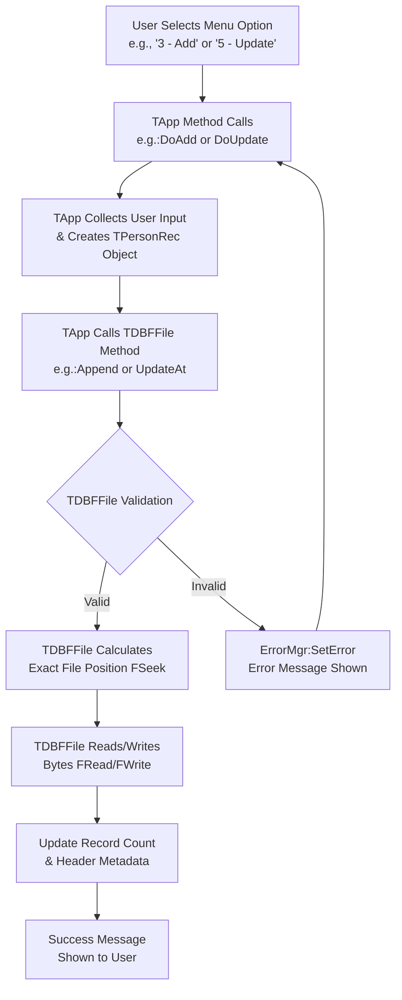

# DBF CRUD

### **1. Code Analysis**

#### **Overall Architecture & Purpose**
This is a sophisticated, object-oriented Harbour application that performs **low-level CRUD (Create, Read, Update, Delete) operations on Harbour (.dbf) files**. The key architectural achievement is that it does **not** use any high-level database commands (like `USE`, `APPEND BLANK`, or `REPLACE`). Instead, it uses only fundamental file I/O functions (`FOpen()`, `FRead()`, `FWrite()`, `FSeek()`, `FClose()`) to manually read and write the binary .dbf file structure, including its header and record data. This is a demonstration of deep understanding of the .dbf file format.

The program is structured into several classes, adhering to the **Single Responsibility Principle**:
-   `TApp`: Handles the user interface (CLI menu) and application flow.
-   `TDBFFile`: The core class managing all low-level file operations.
-   `TPersonRec`: A data model class representing a single record's structure and validation.
-   `TErrorMgr`: A utility class for centralized error handling.
-   Utility Functions: A module for helper functions like endian conversion and string padding.

#### **Key Functions & Programming Patterns**
-   **Object-Oriented Programming (OOP):** The code is beautifully structured using Harbour's OOP features (`CLASS`, `METHOD`, `DATA`), making it modular, maintainable, and easy to understand.
-   **Low-Level File I/O:** The `TDBFFile` class meticulously implements the dBASE III file specification. It correctly handles:
    -   **Header Management:** Writing and reading the file header, which includes the record count, last update date, and field descriptors.
    -   **Record Manipulation:** Precisely calculating byte offsets for records, handling deletion flags (`*` for deleted, space for active), and serializing/deserializing data with proper padding.
-   **Validation:** The `TPersonRec:Validate()` method and `TErrorMgr:Ensure()` provide robust input and data integrity checks.
-   **Error Handling:** The `TErrorMgr` class offers a consistent way to handle and report errors throughout the application.

#### **Notable Optimizations & Considerations**
-   **Efficiency:** The use of `FSeek()` for direct access to records is highly efficient, as it avoids reading the entire file into memory.
-   **Portability:** The utility functions (`LE16()`, `LE32()`) handle little-endian byte ordering, making the code portable across different system architectures.
-   **Potential Enhancement:** The `ListAll()` method currently reads records sequentially. For very large files, this could be optimized by reading chunks of data at a time, but for its purpose, it is perfectly adequate.

---

### **2. User Manual**

#### **Low-Level DBF CRUD Tool User Manual**

**Version:** 1.0.0
**Date:** 2025-08-22

#### **1. Introduction**
Welcome! 👋 This manual describes the **Low-Level DBF CRUD Tool**, a command-line application for managing database (.dbf) files. This tool allows you to create, open, and manipulate dBASE III files entirely through a text-based menu, without requiring any database drivers. It's perfect for learning, data recovery, or working in constrained environments.

#### **2. System Requirements**
-   **Operating System:** Any system capable of running the Harbour compiler and runtime (e.g., Windows, Linux, macOS).
-   **Software:** The Harbour compiler (`harbour` or `hbmk2`) to build the application from the provided source code.
-   **Knowledge:** Basic familiarity with command-line interfaces.

#### **3. Installation & Setup**
1.  **Save the Code:** Ensure all provided `.prg` files (`application.prg`, `dbf_crud.prg`, `error.prg`, `file_i_o.prg`, `recordmodel.prg`, `utility.prg`) are in the same directory.
2.  **Compile the Application:**
    Open a terminal/command prompt in the directory containing the files and run the Harbour compiler. The exact command may vary, but a typical build command is:
    ```bash
    hbmk2 main.prg -o dbfcrud
    ```
    *(You may need to specify all files explicitly: `hbmk2 application.prg dbf_crud.prg error.prg file_i_o.prg recordmodel.prg utility.prg -o dbfcrud`)*
3.  **Run the Program:**
    ```bash
    ./dbfcrud [path_to_your_file.dbf] # On Linux/macOS
    dbfcrud.exe [path_to_your_file.dbf] # On Windows
    ```
    The `[path_to_your_file.dbf]` argument is optional. If omitted, the default file `people.dbf` will be used in the current directory.

#### **4. Usage**
Once launched, the program presents a numbered menu. You interact by typing the number of your desired option and pressing `Enter`.

#### **5. Options & Examples**
Here is a breakdown of each menu option, how to use it, and what to expect.

##### **📁 1) Create DBF**
-   **What it does:** Initializes a new, empty `.dbf` file with the predefined schema for storing person data (name, last name, age, etc.). If the file already exists, it will notify you and not overwrite it.
-   **Example:**
    ```
    Select option: 1
    Created DBF: C:\data\people.dbf
    Press any key to continue...
    ```

##### **📂 2) Open DBF**
-   **What it does:** Opens an existing `.dbf` file, reads its header to get the record count, and prepares it for other operations. You must open or create a file before adding, listing, or modifying records.
-   **Example:**
    ```
    Select option: 2
    Opened DBF: C:\data\people.dbf  Records: 4
    Press any key to continue...
    ```

##### **➕ 3) Add record**
-   **What it does:** Guides you through entering data for a new person. The data is validated before being saved to the file.
-   **Example:**
    ```
    Select option: 3
    Name (1..30): Alice
    Last name (1..30): Smith
    Age (0..999): 29
    Birth date YYYYMMDD: 19941225
    Status (T/F): T
    Record appended. New count: 5
    ```

##### **📋 4) List records**
-   **What it does:** Displays all active (non-deleted) records in the file in a readable format.
-   **Example:**
    ```
    Select option: 4
    -- Active records --
    #1: John, Doe | age= 42 | birth_date= 19801231 | status= T
    #2: Jane, Doe | age= 38 | birth_date= 19850505 | status= T
    #4: Bob, Jones | age= 25 | birth_date= 19981130 | status= F
    Press any key to continue...
    ```
    *(Note: Record #3 is missing because it is logically deleted and thus hidden from the list).*

##### **✏️ 5) Update record**
-   **What it does:** Allows you to modify the data of an existing record by its record number. It first shows the current values.
-   **Example:**
    ```
    Select option: 5
    Record number to update: 2
    Current -> Name: Jane, Last name: Doe, Age: 38, Birth: 19850505, Status: T
    New Name (blank=keep): Jane
    New Last name (blank=keep): Johnson
    New Age (blank=keep): 39
    New Birth date YYYYMMDD (blank=keep):
    New Status T/F (blank=keep):
    Record #2 updated.
    ```

##### **🗑️ 6) Delete record (logical)**
-   **What it does:** Does not physically remove the record from the file. Instead, it marks it with a deletion flag (`*`). "Deleted" records are skipped by the `ListAll()` function. This is a standard practice in DBF files.
-   **Example:**
    ```
    Select option: 6
    Record number to delete (logical): 4
    Record #4 logically deleted (*)
    ```

##### **🔍 7) Read one record**
-   **What it does:** Fetches and displays a single record by its number, including its deletion status. This is useful for inspecting records marked for deletion.
-   **Example:**
    ```
    Select option: 7
    Record number to read: 3
    Deleted:  YES
    Name: Old
    Last name: Record
    Age: 99
    Birth date (YYYYMMDD): 19200101
    Status (T/F): F
    Press any key to continue...
    ```

##### **🔒 8) Close DBF**
-   **What it does:** Properly closes the .dbf file. This operation is critical as it **flushes the updated record count and last-modified date to the file header**. Always close the file before exiting to ensure data integrity.
-   **Example:**
    ```
    Select option: 8
    DBF closed.
    ```

##### **🚪 9) Exit**
-   **What it does:** Safely exits the application. **If a file is still open, it will automatically close it for you** before quitting.
-   **Example:**
    ```
    Select option: 9
    (Program terminates)
    ```

#### **6. Troubleshooting**
-   **"Cannot open file":** The file path might be incorrect, or you may not have read/write permissions for that location.
-   **"Open or create the DBF first":** You tried to perform an operation that requires an open database file. Choose option `1` or `2` first.
-   **"Record number out of range":** You entered a record number that is less than 1 or greater than the total number of records in the file. Use option `4` to list records and see valid numbers, or option `2` to see the total count.
-   **Validation Errors (e.g., "Age must be 0..999"):** The data you entered does not conform to the field rules. Please try again with valid data.

---

### **3. Clear & Engaging Explanation with Emojis**

#### **What This Program Does 🎯**
Imagine you have a digital filing cabinet 📂 that holds index cards 👤 for people. This program is a skilled clerk 🤖 that can:
1.  **Build** a new, empty cabinet from scratch. (`Create`)
2.  **Open** an existing cabinet drawer. (`Open`)
3.  **Add** a new index card to the end of the drawer. (`Append`)
4.  **Read aloud** all the cards that haven't been marked with a big red X. (`ListAll`)
5.  **Find** a specific card, cross out its old info, and write new info. (`UpdateAt`)
6.  **Mark** a card with a big red X without throwing it away. (`DeleteAt` - Logical Delete)
7.  **Peek** at any single card, even if it has a red X. (`ReadAt`)
8.  **Slam the drawer shut** and update the cabinet's master index. (`Close`)

It does all this by knowing the *exact* layout of the cabinet and each card, down to the very byte! 🤯

#### **Visualizing the Process: CRUD Operation Flow**
The following flowchart illustrates the core lifecycle of a CRUD operation within the application, showcasing the interaction between the main menu (`TApp`), the database engine (`TDBFFile`), and the data model (`TPersonRec`).



This diagram shows how user input flows through the object-oriented layers of the application to result in precise low-level file operations.
