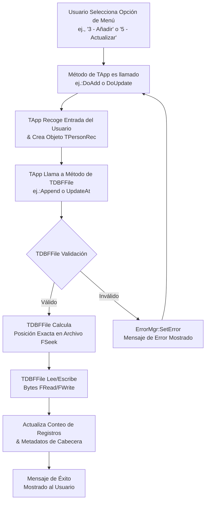

# DBF CRUD

### **1. Análisis del Código**

#### **Arquitectura General y Propósito**
Esta es una aplicación sofisticada y orientada a objetos en Harbour que realiza **operaciones CRUD (Crear, Leer, Actualizar, Borrar) de bajo nivel sobre archivos Harbour (.dbf)**. El logro arquitectónico clave es que **no** utiliza comandos de base de datos de alto nivel (como `USE`, `APPEND BLANK` o `REPLACE`). En su lugar, utiliza únicamente funciones fundamentales de E/S de archivos (`FOpen()`, `FRead()`, `FWrite()`, `FSeek()`, `FClose()`) para leer y escribir manualmente la estructura binaria del archivo .dbf, incluyendo su cabecera y los datos de los registros. Esto demuestra una comprensión profunda del formato de archivo .dbf.

El programa está estructurado en varias clases, adhiriéndose al **Principio de Responsabilidad Única (Single Responsibility Principle)**:
-   `TApp`: Maneja la interfaz de usuario (menú CLI) y el flujo de la aplicación.
-   `TDBFFile`: La clase central que gestiona todas las operaciones de archivo de bajo nivel.
-   `TPersonRec`: Una clase modelo de datos que representa la estructura y validación de un único registro.
-   `TErrorMgr`: Una clase de utilidad para el manejo centralizado de errores.
-   Funciones de Utilidad: Un módulo con funciones auxiliares como conversión de endianness y relleno de cadenas.

#### **Funciones Clave y Patrones de Programación**
-   **Programación Orientada a Objetos (POO):** El código está bellamente estructurado usando las características POO de Harbour (`CLASS`, `METHOD`, `DATA`), haciéndolo modular, mantenible y fácil de entender.
-   **E/S de Archivos de Bajo Nivel:** La clase `TDBFFile` implementa meticulosamente la especificación del archivo dBASE III. Maneja correctamente:
    -   **Gestión de Cabeceras:** Escribir y leer la cabecera del archivo, que incluye el conteo de registros, la fecha de última actualización y los descriptores de campos.
    -   **Manipulación de Registros:** Calcular precisamente los desplazamientos de bytes para los registros, manejar flags de borrado (`*` para borrado, espacio para activo), y serializar/deserializar datos con el relleno adecuado.
-   **Validación:** El método `TPersonRec:Validate()` y `TErrorMgr:Ensure()` proporcionan comprobaciones robustas de integridad de datos y entrada.
-   **Manejo de Errores:** La clase `TErrorMgr` ofrece una forma consistente de manejar y reportar errores en toda la aplicación.

#### **Optimizaciones y Consideraciones Notables**
-   **Eficiencia:** El uso de `FSeek()` para acceso directo a registros es muy eficiente, ya que evita leer el archivo completo en memoria.
-   **Portabilidad:** Las funciones de utilidad (`LE16()`, `LE32()`) manejan el orden de bytes little-endian, haciendo el código portable a diferentes arquitecturas de sistema.
-   **Potencial Mejora:** El método `ListAll()` actualmente lee registros secuencialmente. Para archivos muy grandes, esto podría optimizarse leyendo bloques de datos a la vez, pero para su propósito, es perfectamente adecuado.

---

### **2. Manual de Usuario**

#### **Manual de Usuario de la Herramienta CRUD para DBF de Bajo Nivel**

**Versión:** 1.0.0
**Fecha:** 2025-08-22

#### **1. Introducción**
¡Bienvenido! 👋 Este manual describe la **Herramienta CRUD para DBF de Bajo Nivel**, una aplicación de línea de comandos para gestionar archivos de base de datos (.dbf). Esta herramienta te permite crear, abrir y manipular archivos dBASE III completamente a través de un menú de texto, sin requerir controladores de base de datos. Es perfecta para aprender, recuperar datos o trabajar en entornos restringidos.

#### **2. Requisitos del Sistema**
-   **Sistema Operativo:** Cualquier sistema capaz de ejecutar el compilador Harbour y su entorno de ejecución (ej., Windows, Linux, macOS).
-   **Software:** El compilador Harbour (`harbour` o `hbmk2`) para compilar la aplicación a partir del código fuente proporcionado.
-   **Conocimientos:** Familiaridad básica con interfaces de línea de comandos.

#### **3. Instalación y Configuración**
1.  **Guarda el Código:** Asegúrate de que todos los archivos `.prg` proporcionados (`application.prg`, `dbf_crud.prg`, `error.prg`, `file_i_o.prg`, `recordmodel.prg`, `utility.prg`) estén en el mismo directorio.
2.  **Compila la Aplicación:**
    Abre una terminal/símbolo del sistema en el directorio que contiene los archivos y ejecuta el compilador Harbour. El comando exacto puede variar, pero un comando de compilación típico es:
    ```bash
    hbmk2 main.prg -o dbfcrud
    ```
    *(Puede que necesites especificar todos los archivos explícitamente: `hbmk2 application.prg dbf_crud.prg error.prg file_i_o.prg recordmodel.prg utility.prg -o dbfcrud`)*
3.  **Ejecuta el Programa:**
    ```bash
    ./dbfcrud [ruta_a_tu_archivo.dbf] # En Linux/macOS
    dbfcrud.exe [ruta_a_tu_archivo.dbf] # En Windows
    ```
    El argumento `[ruta_a_tu_archivo.dbf]` es opcional. Si se omite, se usará el archivo por defecto `people.dbf` en el directorio actual.

#### **4. Uso**
Una vez iniciado, el programa presenta un menú numerado. Interactúas escribiendo el número de la opción deseada y presionando `Enter`.

#### **5. Opciones y Ejemplos**
Aquí está el desglose de cada opción del menú, cómo usarla y qué esperar.

##### **📁 1) Crear DBF**
-   **Qué hace:** Inicializa un nuevo archivo `.dbf` vacío con el esquema predefinido para almacenar datos de personas (nombre, apellido, edad, etc.). Si el archivo ya existe, te lo notificará y no lo sobrescribirá.
-   **Ejemplo:**
    ```
    Seleccione opción: 1
    Created DBF: C:\data\people.dbf
    Presione una tecla para continuar...
    ```

##### **📂 2) Abrir DBF**
-   **Qué hace:** Abre un archivo `.dbf` existente, lee su cabecera para obtener el conteo de registros y lo prepara para otras operaciones. Debes abrir o crear un archivo antes de añadir, listar o modificar registros.
-   **Ejemplo:**
    ```
    Seleccione opción: 2
    Opened DBF: C:\data\people.dbf  Records: 4
    Presione una tecla para continuar...
    ```

##### **➕ 3) Añadir registro**
-   **Qué hace:** Te guía através de la introducción de datos para una nueva persona. Los datos se validan antes de guardarse en el archivo.
-   **Ejemplo:**
    ```
    Seleccione opción: 3
    Name (1..30): Alicia
    Last name (1..30): García
    Age (0..999): 29
    Birth date YYYYMMDD: 19941225
    Status (T/F): T
    Record appended. New count: 5
    ```

##### **📋 4) Listar registros**
-   **Qué hace:** Muestra todos los registros activos (no borrados) del archivo en un formato legible.
-   **Ejemplo:**
    ```
    Seleccione opción: 4
    -- Active records --
    #1: Juan, Pérez | age= 42 | birth_date= 19801231 | status= T
    #2: Ana, Gómez | age= 38 | birth_date= 19850505 | status= T
    #4: Luis, López | age= 25 | birth_date= 19981130 | status= F
    Presione una tecla para continuar...
    ```
    *(Nota: Falta el registro #3 porque está borrado lógicamente y por lo tanto oculto en la lista).*

##### **✏️ 5) Actualizar registro**
-   **Qué hace:** Te permite modificar los datos de un registro existente por su número de registro. Primero muestra los valores actuales.
-   **Ejemplo:**
    ```
    Seleccione opción: 5
    Record number to update: 2
    Current -> Name: Ana, Last name: Gómez, Age: 38, Birth: 19850505, Status: T
    New Name (blank=keep): Ana
    New Last name (blank=keep): González
    New Age (blank=keep): 39
    New Birth date YYYYMMDD (blank=keep):
    New Status T/F (blank=keep):
    Record #2 updated.
    ```

##### **🗑️ 6) Borrar registro (lógico)**
-   **Qué hace:** No elimina físicamente el registro del archivo. En su lugar, lo marca con un flag de borrado (`*`). Los registros "borrados" son omitidos por la función `ListAll()`. Esta es una práctica estándar en archivos DBF.
-   **Ejemplo:**
    ```
    Seleccione opción: 6
    Record number to delete (logical): 4
    Record #4 logically deleted (*)
    ```

##### **🔍 7) Leer un registro**
-   **Qué hace:** Recupera y muestra un único registro por su número, incluyendo su estado de borrado. Esto es útil para inspeccionar registros marcados para borrar.
-   **Ejemplo:**
    ```
    Seleccione opción: 7
    Record number to read: 3
    Deleted:  YES
    Name: Viejo
    Last name: Registro
    Age: 99
    Birth date (YYYYMMDD): 19200101
    Status (T/F): F
    Presione una tecla para continuar...
    ```

##### **🔒 8) Cerrar DBF**
-   **Qué hace:** Cierra correctamente el archivo .dbf. Esta operación es crítica ya que **envía a disco el conteo de registros actualizado y la fecha de última modificación en la cabecera del archivo**. Siempre cierra el archivo antes de salir para garantizar la integridad de los datos.
-   **Ejemplo:**
    ```
    Seleccione opción: 8
    DBF closed.
    ```

##### **🚪 9) Salir**
-   **Qué hace:** Sale de la aplicación de forma segura. **Si un archivo todavía está abierto, lo cerrará automáticamente por ti** antes de terminar.
-   **Ejemplo:**
    ```
    Seleccione opción: 9
    (El programa termina)
    ```

#### **6. Resolución de Problemas**
-   **"Cannot open file":** La ruta del archivo podría ser incorrecta, o puede que no tengas permisos de lectura/escritura en esa ubicación.
-   **"Open or create the DBF first":** Intentaste realizar una operación que requiere un archivo de base de datos abierto. Elige primero la opción `1` o `2`.
-   **"Record number out of range":** Ingresaste un número de registro menor que 1 o mayor que el número total de registros en el archivo. Usa la opción `4` para listar registros y ver números válidos, o la opción `2` para ver el conteo total.
-   **Errores de Validación (ej., "Age must be 0..999"):** Los datos que ingresaste no se ajustan a las reglas del campo. Por favor, inténtalo de nuevo con datos válidos.

---

### **3. Explicación Clara y Precisa con Emojis**

#### **Qué Hace Este Programa 🎯**
Imagina que tienes un archivador digital 📂 que guarda fichas 👤 de personas. Este programa es un archivista experto 🤖 que puede:
1.  **Construir** un archivador nuevo y vacío desde cero. (`Crear`)
2.  **Abrir** un cajón existente del archivador. (`Abrir`)
3.  **Añadir** una nueva ficha al final del cajón. (`Añadir`)
4.  **Leer en voz alta** todas las fichas que no han sido marcadas con una gran X roja. (`ListarTodos` - Listar)
5.  **Encontrar** una ficha específica, tachar su información antigua y escribir información nueva. (`ActualizarEn` - Actualizar)
6.  **Marcar** una ficha con una gran X roja sin tirarla a la basura. (`BorrarEn` - Borrado Lógico)
7.  **Echar un vistazo** a cualquier ficha, incluso si tiene una X roja. (`LeerEn` - Leer Uno)
8.  **Cerrar de golpe el cajón** y actualizar el índice maestro del archivador. (`Cerrar`)

¡Hace todo esto conociendo el diseño *exacto* del archivador y de cada ficha, ¡hasta el último byte! 🤯

#### **Visualizando el Proceso: Flujo de una Operación CRUD**
El siguiente diagrama de flujo ilustra el ciclo de vida central de una operación CRUD dentro de la aplicación, mostrando la interacción entre el menú principal (`TApp`), el motor de base de datos (`TDBFFile`) y el modelo de datos (`TPersonRec`).



Este diagrama muestra cómo la entrada del usuario fluye a través de las capas orientadas a objetos de la aplicación para resultar en operaciones precisas de archivo de bajo nivel.
